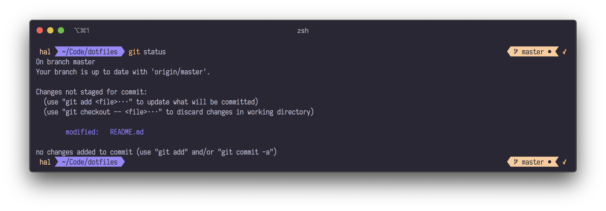
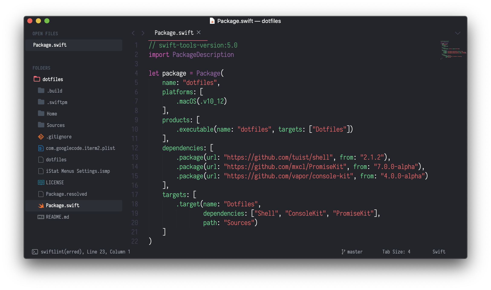
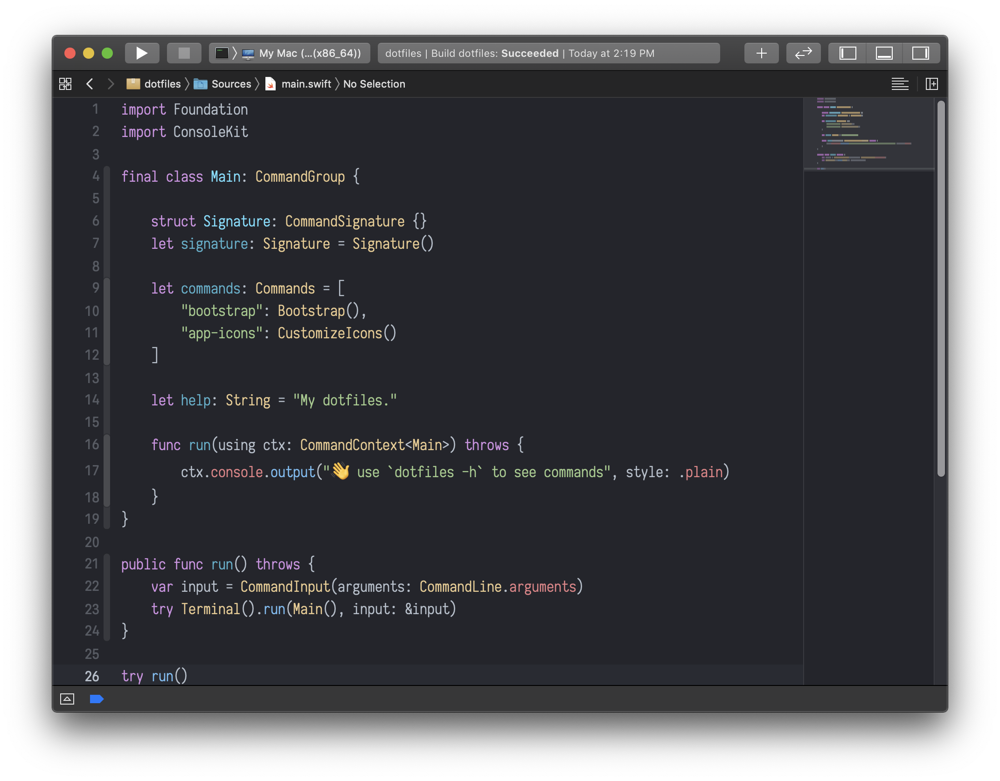
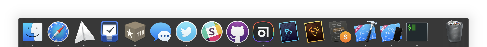

## dotfiles

This is my `dotfiles`; it's a Swift CLI program. See [`Package.swift`](Package.swift).

The goal is to make setting up new computers easy, and to keep settings and preferences in sync between computers I use frequently.

`dotfiles` is highly multithreaded and runs much faster than your usual single-threaded setup shell script.

## Installation

```sh
brew tap hallee/tap
brew install hallee/tap/dotfiles
dotfiles bootstrap # initial setup
```

Files in [Home](Home) will be symlinked to `~`.

`dotfiles` depends on a private git repo for my font files, so font installation may fail.

## Pretty screenshots

#### iTerm + `zsh`

I use iTerm2 with `zsh` and Antigen for plugin management.



#### Sublime Text

My Sublime settings are a bit involved. Everything is symlinked and synced between computers through a repo, https://github.com/hallee/sublime-settings, that contains `Packages` and `Installed Packages`.



#### Xcode

I use a theme based off of GitHub's "One Dark" theme.



#### Dock

I still like to customize some app icons. `dotfiles` has a command for this:

```sh
sudo dotfiles app-icons
```



#### iStat Menus + Bartender

iStat Menus shows a history of CPU usage and GPU usage, with the current CPU temperature. Bartender hides ugly status bar icons.


## Development

#### Building `dotfiles` from source

```sh
git clone git@github.com:hallee/dotfiles.git
cd dotfiles
swift build -c release
cp .build/release/dotfiles .
./dotfiles
```
