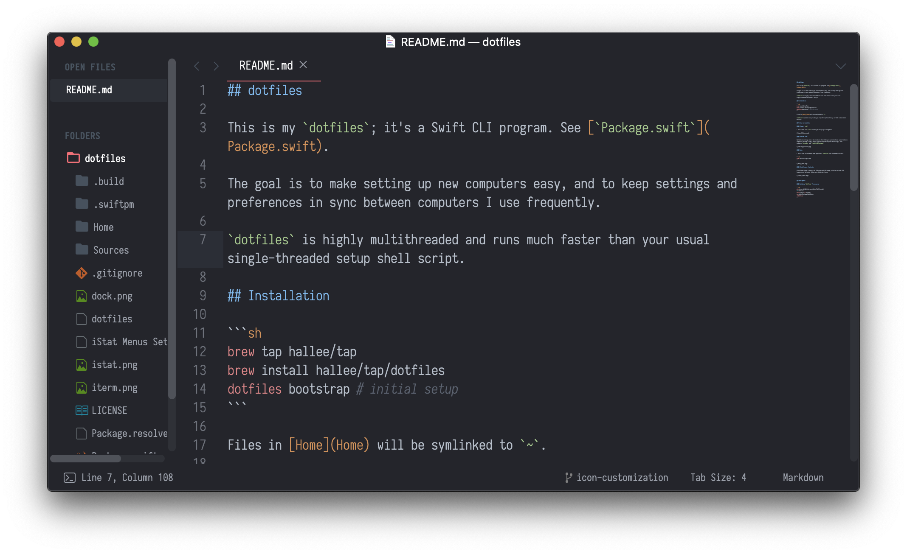

## dotfiles

This is my dotfiles. The goal is to make setting up new computers easier, and to keep critical settings and preferences in sync between computers I use frequently.

`dotfiles` is a Swift CLI program. See [`Package.swift`](Package.swift).

### Installation

```sh
brew tap hallee/tap
brew install hallee/tap/dotfiles
dotfiles bootstrap # initial setup
```

Files in [Home](Home) will be symlinked to `~`.

### Building `dotfiles` from source

```sh
git clone git@github.com:hallee/dotfiles.git
cd dotfiles
swift build -c release
cp .build/release/dotfiles .
./dotfiles
```

### iTerm + `zsh`

I use iTerm2 with `zsh` and Antigen for plugin management.


### Sublime Text

My Sublime settings are a bit involved. Everything is symlinked and synced between computers through a private repo, https://github.com/hallee/sublime-settings, that contains `Packages` and `Installed Packages`.



### iStat Menus + Bartender

I like a clean menu bar.


