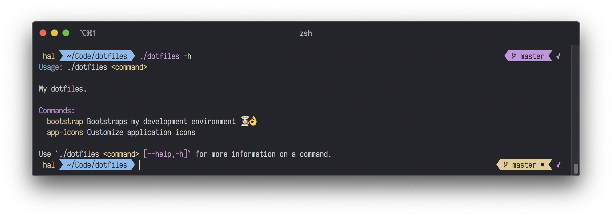

## dotfiles

This is my dotfiles. The goal is to make setting up new computers easier, and to keep critical settings and preferences in sync between my handful of computers I use frequently.

`dotfiles`, and this repository, is a Swift CLI program.

### Installation

```sh
brew tap hallee/tap
brew install hallee/tap/dotfiles
```

### Usage

```sh
dotfiles bootstrap # initial setup
```

### Building `dotfiles` from source

```sh
git clone git@github.com:hallee/dotfiles.git
cd dotfiles
swift build -c release
cp .build/release/dotfiles .
./dotfiles
```

### iTerm + `zsh`

I use iTerm2 with `zsh` and Antigen for plugin management.



### Sublime Text


### iStat Menus


